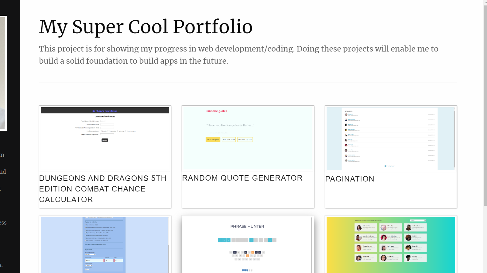

# Static-Node.js-and-Express-Site

Create a portfolio site using express and pug templating.



# Install
```
npm install
```

# Run
```
npm start
```


#### More Details

This project utilizes error handling and routing using express. The projects are rendered from templates by getting data from a JSON file.
